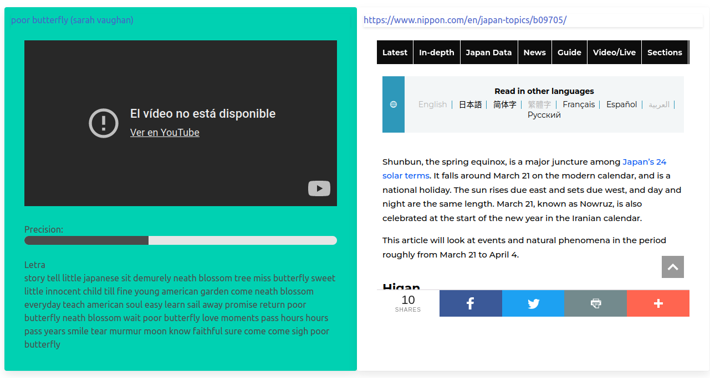
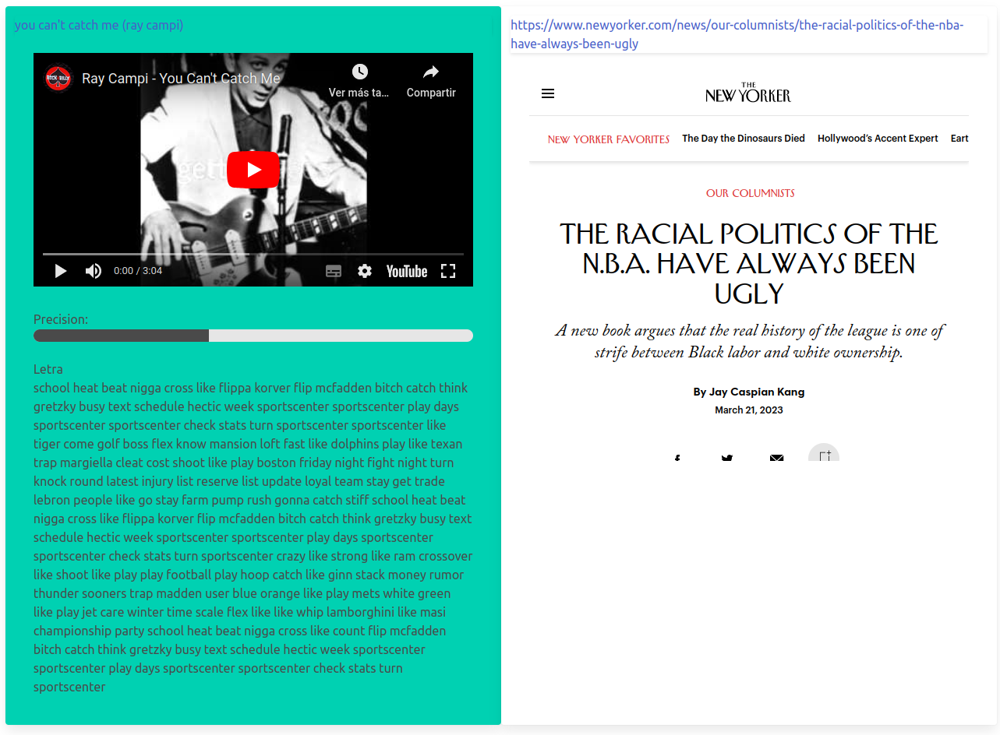
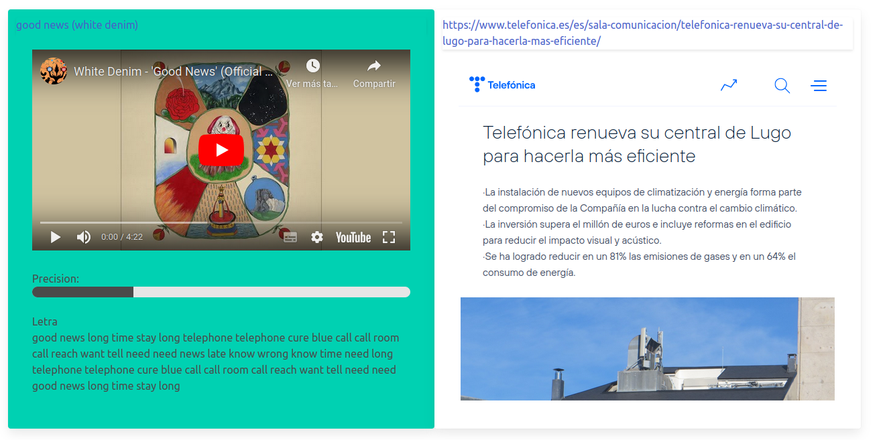
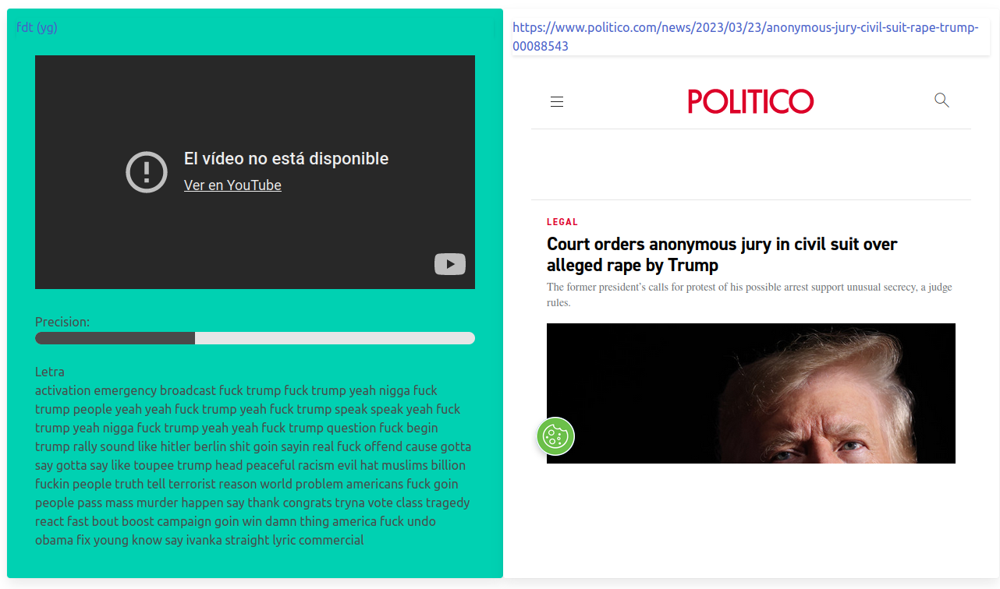
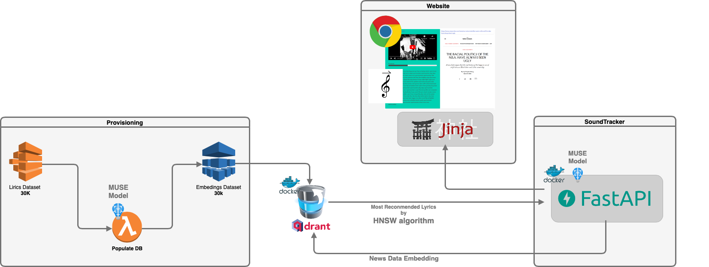

# CognitiveEquinox23

Soundtrack para noticias

Soundtrack es un proyecto que se basa en el uso de QDRANT como base de datos vectorial y su búsqueda basada en la mejora del vecinos más cercanos mediante Hierarchical Navigable Small World (HNSW) graph.

Para ellos hemos usado el MUSE Model para generar los embedings de una dataset de canciones.  
Para poblar la base de datos hemos usado un procedimiento de provisioning que realiza el paso a vector de cada una de las canciones y la inserción en la base de datos. 

Para poder consumir estos datos hemos hecho una pequeña web, que permite buscar una canción relacionada con una noticia.  
Para ello, hemos creado un cuadro de texto donde puede pegar la noticia o pasar un link.  
Con esta información, pasamos al MUSE Model para sacar el vector de la noticia y tras ello hacemos la petición en la base de datos para sacar las 5 canciones más similares.  

Con toda esta información generamos la web. Como puntos extras, hemos añadido una búsqueda a youtube para que la canciones se pueda reproducir directamente.
<p align="center">
    
    
    
    
</p>

# Arquitectura



## Development

### Faster development

To mount code as volume for faster development use next recipe.

```bash
cp docker-compose.override.yml{.tmpl,}
```

Edit your *docker-compose.override.yml* file for more custom modifications.

### Load data

Download dataset from https://www.kaggle.com/datasets/saurabhshahane/music-dataset-1950-to-2019 and copy
to *api/resources* directory

``` bash
$ docker-compose run -it api /bin/bash
root@1835f1a2da0c:/code# PYTHONPATH="/code" python app/provisioning/parse_songs.py
root@1835f1a2da0c:/code# PYTHONPATH="/code" python app/provisioning/add_songs.py
```
